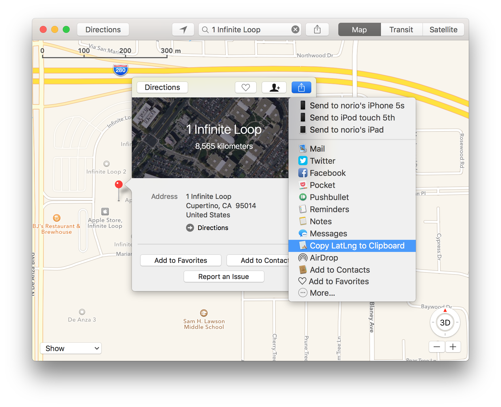
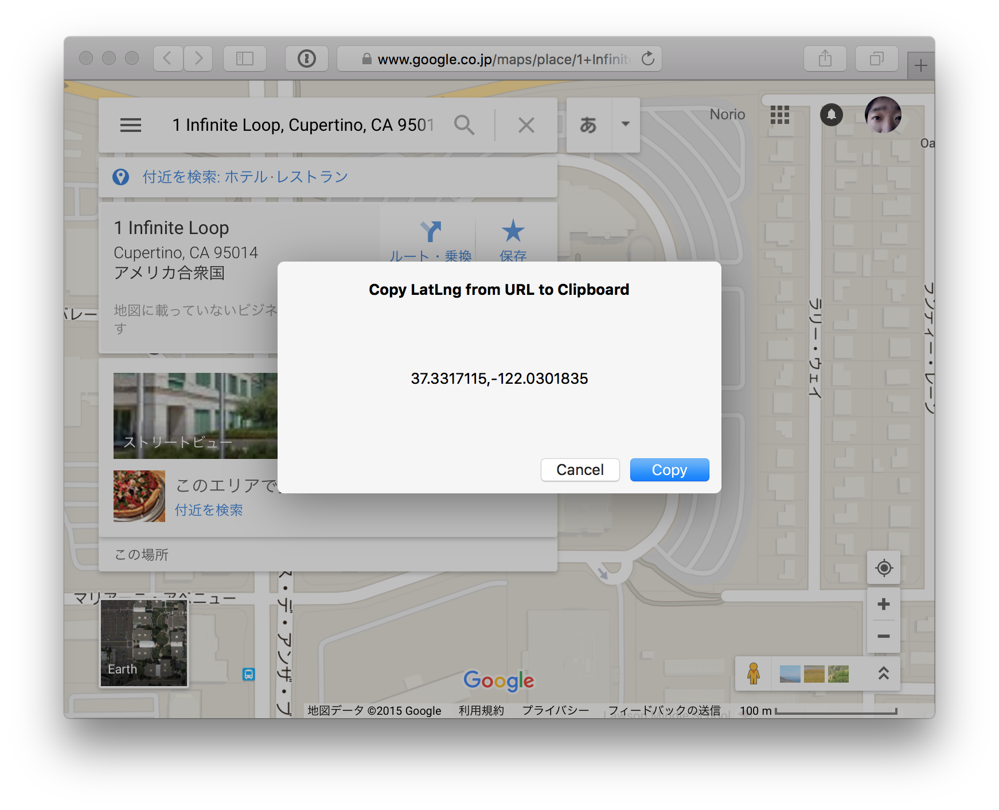

# CopyLatLngOnMaps

*CopyLatLngOnMaps* is Share Extension for WebPage detecting Latitude/Longitude from URL and copy it to Clipboard.
Designed for using with *Maps for OS X* and *Google Maps on Safari*.

## Screenshots
### Selecting "Copy LatLng to Clipboard" from Share Menu on Maps for OS X

### Click "Copy" button on Google Maps(Safari)

## Requirements
- OS X 10.10.5 or later

## How to install
1. Download container app of Share Extension [CopyLatLngOnMaps-0.3.zip](http://github.com/norio-nomura/CopyLatLngOnMaps/releases/download/0.3/CopyLatLngOnMaps-0.3.zip) (2015/10/02 updated)
2. Unzip it
3. Move `CopyLatLngOnMaps.app` to `/Applications` folder

## License
	(The WTFPL)
	
	            DO WHAT THE FUCK YOU WANT TO PUBLIC LICENSE
	                    Version 2, December 2004
	
	 Copyright (C) 2014 Norio Nomura
	
	 Everyone is permitted to copy and distribute verbatim or modified
	 copies of this license document, and changing it is allowed as long
	 as the name is changed.
	
	            DO WHAT THE FUCK YOU WANT TO PUBLIC LICENSE
	   TERMS AND CONDITIONS FOR COPYING, DISTRIBUTION AND MODIFICATION
	
	  0. You just DO WHAT THE FUCK YOU WANT TO.
